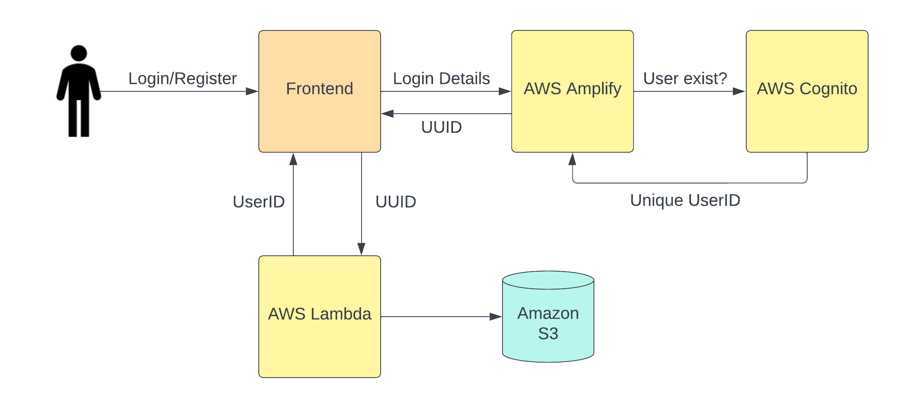
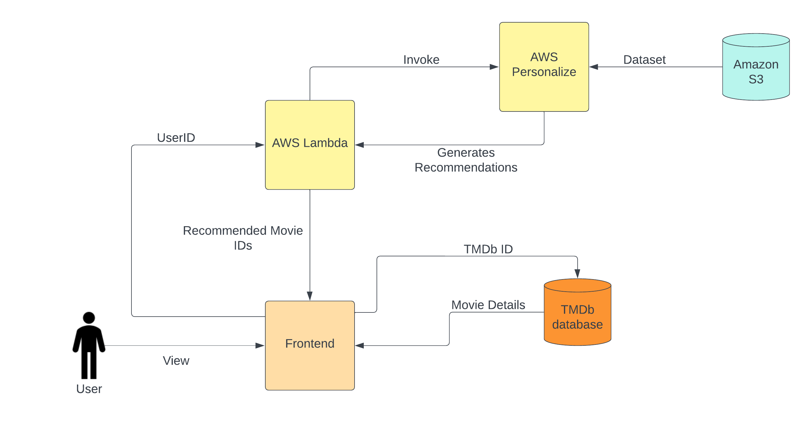
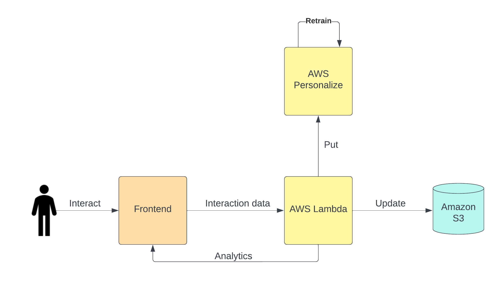

  

# 🎬 INTELLISTREAM 🎬

**FireTV IntelliStream** leverages advanced AI to account for evolving preferences, providing diverse recommendations, ensuring users spend less time searching and more time immersed in content. The frontend is powered by Reactjs and the backend is fully hosted on AWS.

 **Prototype Demo -** [Youtube Link](https://www.youtube.com/watch?v=eQrhOHf9vpI)

---

## 🚀 Prototype 🚀

### Workflow:

  

- **User Authentication:** AWS Amplify & AWS Cognito manage user auth. Cognito User Pools store user profiles & tokens. Unique user IDs from Cognito map to S3 data.
  
- **System Architecture:** Frontend communicates with AWS Lambda functions via HTTP API Gateway for efficient data flow.

- **Movie Recommendations:** AWS Personalize provides movie recommendations. Movie details are fetched from TMDb API.

- **User Interactions:** Activities like watching, clicking, and liking influence user profiles and personalized recommendations.

  

### AWS PERSONALIZE - Working and Retraining:

- **Dataset:** Uses the MovieLens dataset stored on AWS S3.

- **Unstructured Data for Scalability:** Unstructured data is stored as it is very cost-effective.

- **Event Tracking:** Tracks user interactions and logs them as events. Preprocessed data then feeds into AWS Personalize.

- **Machine Learning Models:** AWS Personalize trains models for personalized recommendations.

- **Retraining and Batch Mode:** Retraining frequency depends on how fast user preferences change and the volume of new data collected, all to keep recommendations relevant.
After retraining , recommendations are updated for all users simultaneously.

  

---

## ⚙️ Our Solution  ⚙️

To gain a significant edge over existing recommender systems, Intellistream aims to integrate users' evolving emotional states when making content recommendations. Our strategy involves utilizing sentiment analysis on movie reviews to determine the emotional context of each film. By assessing a user's current mood, we will recommend movies that align with their emotional state.

### Judging Users Mood:

- **Naive Method:** Directly ask users their current genre preference.
  
- **Interaction Analysis:** Track genre interactions over time.
  
- **Rating Analysis:** Understand preferences through ratings and reviews.
  
- **Watch History:** We use a user's viewing history to determine their preferred genres.
  
- **Filtering in AWS Personalize:** Filter movies that match users’ current moods.

**Multilingual Voice Commands:** Implementing voice recognition to enhance user experience by allowing user queries that follow the pattern "find me something similar to <this>." This integration must be designed to comprehend multiple languages and dialects, catering to a global audience.

**Cross-device Integration:** Integrate activity from other Amazon services like Kindle and Music to provide more holistic understanding of preferences.

**Family Friendly Filters** - // add text

---

## 🌟 Solution Enhancement 🌟

Having integrated user mood into our recommender system, our next step is to assess users' preferences before making content recommendations. This involves creating user profiles that track their genre interests, allowing us to provide collaborative recommendations.

### Key Idea:

- **Video Player for Trailers:** Introduce an inbuilt video player to showcase movie trailers. A-priori analyze trailers frame-by-frame for moods, genres, and concepts.

- **Mood and Genre Categorization:** Categorize recognized elements in trailers.

- **User Preference Profiling:** Update user profiles based on trailer interactions.

- **Recommendation Engine:** Recommendations based on trailer content. if a user enjoyed action-packed scenes in a trailer, the system can recommend action movies with similar scenes or moods.

---

### 💵 Business Opportunity 💵

- **Audience Expansion:** Attract a broader audience, enhancing Intellistream’s market share.

- **Monetization Channels:** Precise recommendations and exclusive early releases in collaboration with content providers enhance the appeal of premium content purchases or rentals to customers.

- **Brand Loyalty:** Satisfied users are more likely to recommend IntelliStream to peers, organically increasing its user base.

- **Personalized Ad Recommendations:** Tailor ads to individual users, increasing click-through rates.

